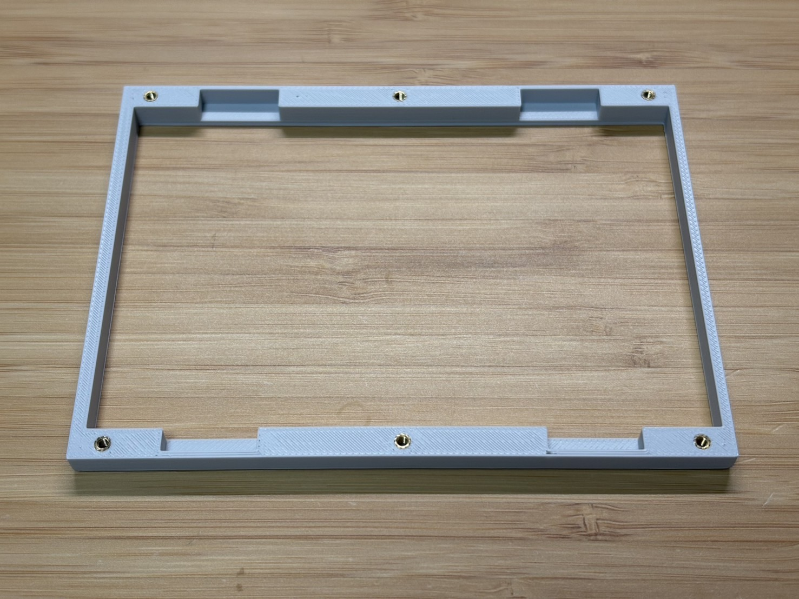
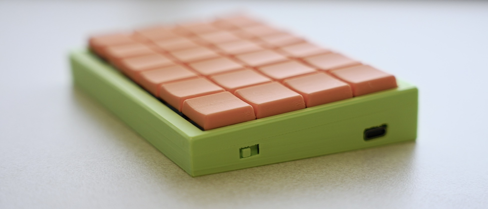
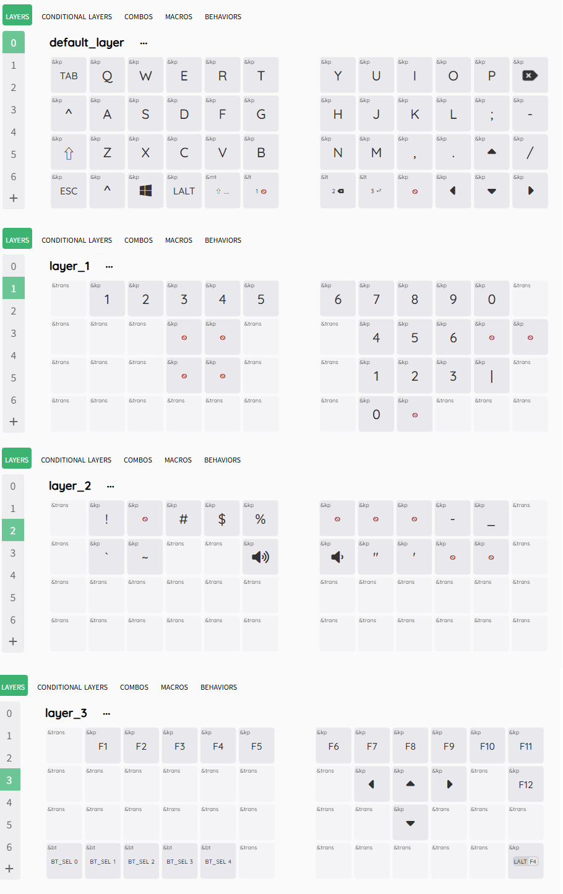

# PEKS48-miniビルドガイド
自作キーボードキットPEKS48-miniのビルドガイドです。 
はんだ付け済み、ケース付き、ファームウェア書き込み済みですので、
ネジを締めて頂くだけでお使い頂けます。

## キット内容

| 名称                   | 数  |　補足                                  |
| ---------------------- | --- | ---                                   |
| メイン基板              | 2   |マイコンなど実装済み                     |
| トッププレート          | 2   |                                        |
| ケース(ボトム)          | 1   |                                       |
| ケース(トップ)          | 1   |                                       |
| Li-Poバッテリ          | 2   |                                        |
| ガスケット用フォーム     |  -  |ケース及び基板の必要個所に取付済み        |
| M2ネジ                 | 12   |                                       |
| ゴム足                 | 4    |                                       |

## キット以外に必要なもの

| 名称                     | 数  |　補足         |
| ----------------------   | --- | ---          |
| キースイッチ              | 48  |choc v2互換　　|

## 組み立て手順
以下の状態で郵送されます（右手用）。 
ネジも既に締められた状態です。 
 

キーキャップをとると右用か左用かが書かれています。 
PEKS48はハードウェアとしては右も左も完全に同じものです。ファームウェアのみ異なります。 
 

裏返すと6か所にネジがあるので外します。 
(裏面には直径6mm厚さ2.5mmの磁石を入れることが出来る穴があるのでご自由に使用してください) 
ネジを外すとケース(トップ) が外せます。 
右の図はケース(トップ) を外した状態です。 
 

次に、メイン基板の下側にバッテリが入っていますので、メイン基板と接続します。 
 

バッテリがコネクタや無線給電用子基板と干渉しないように配置して、メイン基板をケースに収めます。 
その際、以下のようにケーブルをケースと基板の間に挟まないように注意してください。 
 

次に、トッププレートにスイッチをはめていきます。 
本キーボードは打鍵感向上の為にすでにスイッチ用フォームが基板に貼ってあります。 
Choc V2用のフォームではないですがこのまま挿して問題ないです。 
この時点でキーキャップまではめてもよいです。 
 

ボトムケース、メイン基板＋トッププレート、トップケースの順に重ねてねじを締めます。 
トップケースにはインサートナットが埋め込まれています。 
 
また、ケース(トップ) は左右対称ではなく、右側が少し太くなっています。 
分かりにくいですが、若干太い方を右側にしてください。

最後に、ケース（トップ）を基板に被せて、開けた時のようにボトム側から6か所のネジを締めれば完成です。 
この際、ナットが落ちないように横向きに回転させると作業しやすいと思います。 
ケース裏面にゴム足を張る丸いマークがついています。ここに付属のゴム足をはると給電ドックとぴったりはまります。 
 

完成です！！ 
 

## 電源スイッチ
キーボード横に電源用スイッチがあります。（下記写真の左側の四角い穴） 
キーボードに向かって奥側（下記写真の右方向）が「ON」（バッテリからの給電許可）です。 
無線給電時はスイッチが「ON」でも「OFF」でも起動します。 
バッテリに充電したいときは「ON」にしてから給電ドックもしくはUSBを接続して充電してください。 
 

## 初期キー配置
初期のキー配置は以下のようになっています。 
(日本語キーボードとして使用しているのでkeymap Editor上では一部エラーとして表示されてしまいます) 
詳細なキー配置は下記レポジトリのpeks48.keymapをご確認ください。 
[https://github.com/PowerEnterKey/zmk-PEKS48 ](https://github.com/PowerEnterKey/zmk-PEKS48/blob/main/boards/shields/peks48/peks48.keymap)
 

PEKS48はKeymap Editorに対応しています。 
キーマップを変更したい場合は、
下記レポジトリをご自身のアカウントでフォークしてKeymap Editorにて変更をお願いします。 
https://github.com/PowerEnterKey/zmk-PEKS48 
ZMK StudioおよびKeymap Editorの詳しい使用方法につきましては、公開先のウェブサイトをご確認下さい。

## Bluetoothが繋がらない場合
PCとBluetoothのch選択が間違っている可能性があります。
Layer3にてBluetoothのchを変更してみてください。

それでもPCとBluetoothで接続できない場合は再度ファームウェアの書き込みを行ってください。 
右手用は下記の手順で実施します。 
・PCとPEKS48をUSBで接続します。 
・マイコン（XIAO BLE）のリセットボタンを2回連続で押すと、「XIAO SENSE」という名前でUSBドライブとして認識されます。 
・本レポジトリ内にある「settings_reset-seeeduino_xiao_ble-zmk.uf2」を「XIAO SENSE」にドラック&ドロップします。 
　書込みが完了すると「XIAO SENSE」ドライブは消えます。 
・再度リセットボタンを2回連続で押して、本レポジトリ内の「peks48_r rgbled_adapter-seeeduino_xiao_ble-zmk.uf2」にドラック&ドロップします。 

左手用は上記手順で最後に「peks48_l rgbled_adapter-seeeduino_xiao_ble-zmk.uf2」を書きます。 

