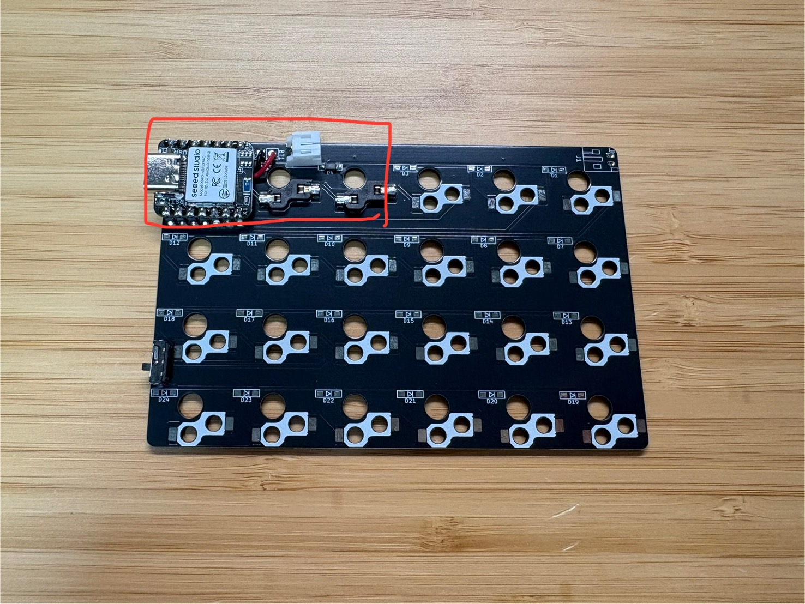
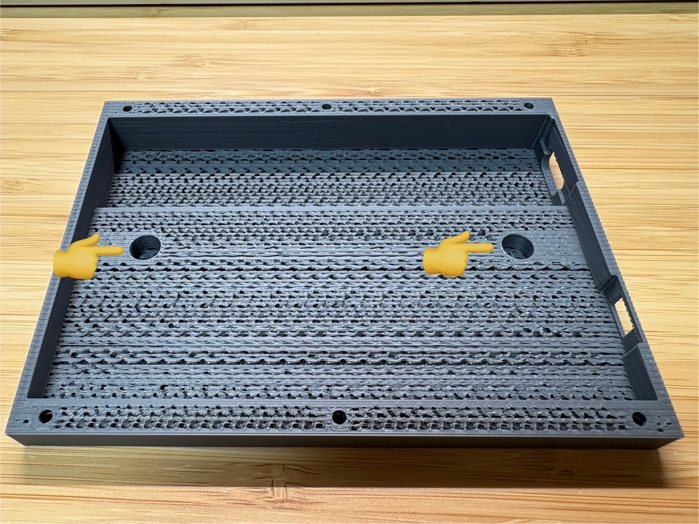
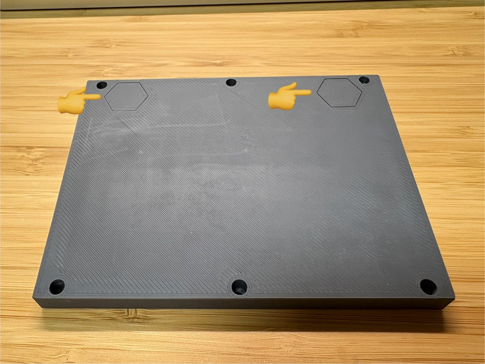

# PEKS48-miniビルドガイド
自作キーボードキットPEKS48-miniのビルドガイドです。 
はんだ付け済み、ケース付き、ファームウェア書き込み済みですので、 
ネジを締めて頂くだけでお使い頂けます。 
※半改正品はダイオード及びスイッチソケットのみはんだ付けが必要です。

## キット内容

| 名称                   | 数  |　補足                                  |
| ---------------------- | --- | ---                                   |
| メイン基板              | 2   |マイコンなど実装済み                     |
| トッププレート          | 2   |                                        |
| ケース(ボトム)          | 1   |                                       |
| ケース(トップ)          | 1   |                                       |
| Li-Poバッテリ          | 2   |                                        |
| ガスケット用フォーム     |  -  |ケース及び基板の必要個所に取付済み        |
| スイッチ取付面静音フォーム| 48   |                                       |
| M2ネジ                 | 12   |                                       |
| ゴム足                 | 4    |                                       |
| ダイオード             | 42+α  |半完成品のみ              　　　　       |
| スイッチソケット        | 42+α  |半完成品のみ             　　　　        |

※2026/1/4販売分まではスイッチ取付面静音フォームは取り付け済みで送付していましたが、 
　取り付け済みの状態だとスイッチの指す向きが分かりにくいことやフォーム自体がChoc V2適合品ではないことから 
　2026/1/4販売分から取り付けずに配布することにしました。 
　フォームを使用することで音は良くなるので取り付けを推奨しています。 
　取り付け向き等は以降の画像を参照ください。 

## キット以外に必要なもの

| 名称                     | 数  |　補足         |
| ----------------------   | --- | ---          |
| キースイッチ              | 48  |choc v2互換　　|

## 組み立て手順
梱包を解いていただくと、右用(R)か左用(L)かが書かれています。 
PEKS48-miniはハードウェアとしては右も左も完全に同じものです。ファームウェアのみ異なります。 
 

裏返すと6か所にネジがあるので外します。 
ネジを外すとケース(トップ) が外せます。 
右の図はケース(トップ) を外した状態です。 
 

次に、メイン基板を取り出します。メイン基板の下側にバッテリが入っています。 
 

※※※以下は半完成品の説明です※※※ 
半完成品はダイオード及びスイッチソケットのみはんだ付けする必要があります。 
下画像の赤い部分(3ヶ所)は既にはんだ付けしてあります。 
なので1基板につき21ヶ所のダイオード及びスイッチソケットのはんだ付けを行ってください。 
部品の向きは既にはんだ付け済みの箇所を参考に行ってください。 

 
※※※半完成品の説明はここまで※※※ 

次に、スイッチ用フォームを部品取り付け面と反対側に貼ります。 
Choc V2用のフォームではないですが、下部で出てくる画像を参考に中心の穴が合うように貼ってください。 
（スイッチを装着する際はフォームを貫通させて問題ないです） 

また、2026/1/4販売分からケース内部に磁石を入れる穴を付けました。 
左右のキーボードで磁石を揃えて入れると、左右のキーボードの底面同時でピタッとくっつくので持ち運びに便利です。 
 

フォームを張り終えたら基板とバッテリを接続します。 
 

バッテリがコネクタや無線給電用子基板と干渉しないように配置して、メイン基板をケースに収めます。 
※※その際、以下のようにケーブルをケースと基板の間に挟んでしまうと、故障や火災の原因になりますので特に注意してください。※※ 
 

電源スイッチのカバーの勘合が緩い場合があるので落ちないように写真のように入れてください。 
 

次に、トッププレートにスイッチをはめていきます。 
スイッチはピンがある方が南側にくる向きではめてください。 
四隅をはめたらトッププレートごとスイッチを基板に挿します。 
そうする事で残りのキースイッチが挿しやすくなります。 
トッププレートはそこまで強度がないので注意して扱ってください。 
Choc V2用のフォームではないですがこのまま挿して（フォームを貫通させて）問題ないです。 
この時点でキーキャップまではめてもよいです。 
 

次にボトムケース、メイン基板＋トッププレート、トップケースの順に重ねてねじを締めていきます。 
なお、下記写真のようにトップケースにはインサートナットが埋め込まれています。 
 

また、トッププレートは左右対称ではなく、左側の淵が少し太くなっています。 
分かりにくいですが、トップケースと重ねた際に、両端の隙間に偏りがない重ね方が正しいです。 
下記写真の左側が正しい重ね方で、右側が間違っています。 
トッププレートの端が若干太い方を左側にくるようにしてください。 
 

最後に、ケース（トップ）を基板に被せて、開けた時のようにボトム側から6か所のネジを締めれば完成です。 
ケース裏面にあるマークに合わせて滑り止めを張ってください。 
※2026/1/4販売分から滑り止めがグリップラスという製品になりました。 
それに合わせてケース裏の滑り止めマークが六角形になりました。 
 

完成です!! 
 

## 電源スイッチ
キーボード横に電源用スイッチがあります。（下記写真の左側の四角い穴） 
キーボードに向かって奥側（下記写真の右方向）が「ON」（バッテリからの給電許可）です。 
無線給電時はスイッチが「ON」でも「OFF」でも起動します。 
バッテリに充電したいときは「ON」にしてから給電ドックもしくはUSBを接続して充電してください。 
 

## 初期キー配置
初期のキー配置は以下のようになっています。 
(日本語キーボードとして使用しているのでkeymap Editor上では一部エラーとして表示されてしまいます) 
詳細なキー配置は下記レポジトリのpeks48.keymapをご確認ください。 
[https://github.com/PowerEnterKey/zmk-PEKS48 ](https://github.com/PowerEnterKey/zmk-PEKS48/blob/main/boards/shields/peks48/peks48.keymap)
 

PEKS48はKeymap Editorに対応しています。 
キーマップを変更したい場合は、
下記レポジトリをご自身のアカウントでフォークしてKeymap Editorにて変更をお願いします。 
https://github.com/PowerEnterKey/zmk-PEKS48 
ZMK StudioおよびKeymap Editorの詳しい使用方法につきましては、公開先のウェブサイトをご確認下さい。 

※ファームウェアはPEKS48と同じです 

## Bluetoothが繋がらない場合
PCとBluetoothのch選択が不整合の可能性があります。 
Layer3にてBluetoothのchを変更してみてください。 

それでもPCとBluetoothで接続できない場合は再度ファームウェアの書き込みを行ってください。 
右手用は下記の手順で実施します。 
・PCとPEKS48をUSBで接続します。 
・マイコン（XIAO BLE）のリセットボタンを2回連続で押すと、「XIAO SENSE」という名前でUSBドライブとして認識されます。 
・本レポジトリ内にある「settings_reset-seeeduino_xiao_ble-zmk.uf2」を「XIAO SENSE」にドラック&ドロップします。 
　書込みが完了すると「XIAO SENSE」ドライブは消えます。 
・再度リセットボタンを2回連続で押して、本レポジトリ内の「peks48_r rgbled_adapter-seeeduino_xiao_ble-zmk.uf2」にドラック&ドロップします。 

左手用は上記手順で最後に「peks48_l rgbled_adapter-seeeduino_xiao_ble-zmk.uf2」を書きます。 

